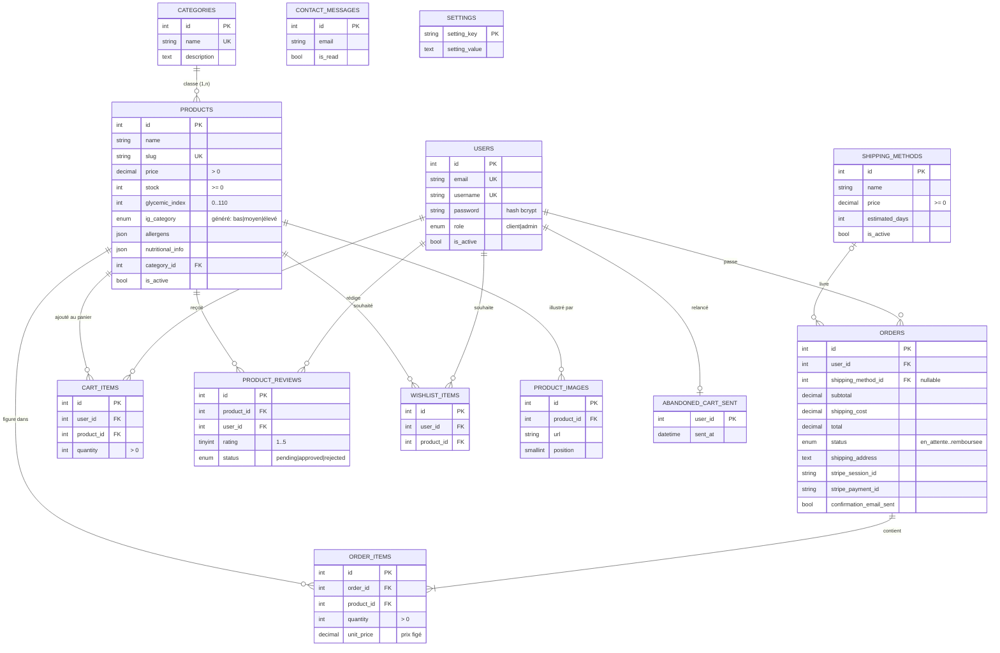

# GlyciBio — Modèle de données

> Pièce du dossier de projet DWWM — compétence *« Mettre en place une base de
> données relationnelle »*. SGBD : **MySQL 8 / InnoDB** (transactions, clés
> étrangères, contraintes CHECK, colonne générée, FULLTEXT, déclencheurs).
> Source de vérité : `database/glycibio-database-production.sql`.

## 1. Modèle Conceptuel de Données (MCD)

Diagramme entité-association (notation Mermaid — rendu automatique sur GitHub /
VS Code). Les associations *panier*, *avis* et *favoris* sont des associations
entre `users` et `products` ; `order_items` porte la quantité et le prix unitaire
figé au moment de la commande.

### Cardinalités (lecture Merise)

| Association | Cardinalités | Règle métier |
|---|---|---|
| categories — products | (1,1) — (0,n) | un produit appartient à **une** catégorie ; suppression d'une catégorie **interdite** s'il reste des produits (`ON DELETE RESTRICT`) |
| users — orders | (1,1) — (0,n) | suppression d'un compte ⇒ ses commandes supprimées (`CASCADE`, RGPD) |
| shipping_methods — orders | (0,1) — (0,n) | mode de livraison facultatif ; supprimé ⇒ `NULL` sur la commande (`SET NULL`) |
| orders — order_items | (1,1) — (1,n) | une commande contient au moins une ligne ; suppression ⇒ lignes supprimées (`CASCADE`) |
| products — order_items | (1,1) — (0,n) | un produit référencé par une commande **ne peut être supprimé** (`RESTRICT`, intégrité comptable) |
| users × products (cart_items) | association porteuse (quantité) | clé d'unicité `(user_id, product_id)` : une seule ligne par produit/panier |
| users × products (product_reviews) | association porteuse (note, avis) | `UNIQUE(user_id, product_id)` : **un seul avis** par client/produit |
| users × products (wishlist_items) | association pure | `UNIQUE(user_id, product_id)` |

---

## 2. Modèle Logique de Données (MLD)

Notation relationnelle ( **PK** souligné = clé primaire, *#FK* = clé étrangère ) :

- **categories** (<u>id</u>, name, description, created_at, updated_at)
- **users** (<u>id</u>, username, email, password, role, first_name, last_name, address, phone, reset_token, reset_token_expires, failed_attempts, locked_until, newsletter_opt_in, newsletter_opt_in_at, tokens_valid_after, email_verified, verification_token, verification_token_expires, is_active, created_at, updated_at)
- **products** (<u>id</u>, name, slug, description, price, image, stock, glycemic_index, ig_category, allergens, nutritional_info, *#category_id*, is_active, created_at, updated_at)
- **shipping_methods** (<u>id</u>, name, price, estimated_days, is_active, created_at)
- **orders** (<u>id</u>, *#user_id*, *#shipping_method_id*, subtotal, shipping_cost, total, status, shipping_address, stripe_session_id, stripe_payment_id, confirmation_email_sent, notes, created_at, updated_at)
- **order_items** (<u>id</u>, *#order_id*, *#product_id*, quantity, unit_price)
- **cart_items** (<u>id</u>, *#user_id*, *#product_id*, quantity, created_at, updated_at) — *unique (user_id, product_id)*
- **contact_messages** (<u>id</u>, name, email, subject, message, is_read, created_at)
- **product_reviews** (<u>id</u>, *#product_id*, *#user_id*, rating, title, comment, status, created_at, updated_at) — *unique (user_id, product_id)*
- **wishlist_items** (<u>id</u>, *#user_id*, *#product_id*, created_at) — *unique (user_id, product_id)*
- **product_images** (<u>id</u>, *#product_id*, url, alt, position, created_at)
- **abandoned_cart_sent** (<u>#user_id</u>, sent_at)
- **settings** (<u>setting_key</u>, setting_value, updated_at)

> Les colonnes `email_verified`, `verification_token`, `verification_token_expires`
> (table `users`) sont ajoutées **au démarrage** par une migration applicative
> idempotente (`UserRepository.ensureColumns`) ; elles font donc partie du schéma
> en exploitation.

---

## 3. Dictionnaire de données

Types MySQL. PK = clé primaire, FK = clé étrangère, UK = unique, NN = non null.

### categories
| Champ | Type | Contraintes | Description |
|---|---|---|---|
| id | INT | PK, auto-incr | Identifiant |
| name | VARCHAR(100) | NN, UK | Nom de la catégorie |
| description | TEXT | — | Description |
| created_at / updated_at | DATETIME | NN | Horodatage création / MAJ |

### users
| Champ | Type | Contraintes | Description |
|---|---|---|---|
| id | INT | PK | Identifiant |
| username | VARCHAR(100) | NN, UK | Identifiant public |
| email | VARCHAR(255) | NN, UK | Email (login) |
| password | VARCHAR(255) | NN | **Hash bcrypt (coût 12)** — jamais en clair |
| role | ENUM('client','admin') | NN, défaut `client` | Rôle / autorisation |
| first_name / last_name | VARCHAR(100) | — | Identité |
| address | TEXT | — | Adresse par défaut |
| phone | VARCHAR(20) | — | Téléphone |
| reset_token / reset_token_expires | VARCHAR(255) / DATETIME | — | Réinit. mot de passe (jeton **haché**, à expiration) |
| failed_attempts | INT | NN, défaut 0 | Tentatives échouées (anti-brute-force) |
| locked_until | DATETIME | — | Verrouillage temporaire du compte |
| newsletter_opt_in / _at | TINYINT(1) / DATETIME | — | Consentement newsletter **horodaté (RGPD)** |
| tokens_valid_after | DATETIME | — | Invalide les JWT émis avant (reset mdp / changement de rôle) |
| email_verified | TINYINT(1) | défaut 0 | Email confirmé (vérification souple) |
| verification_token / _expires | VARCHAR(64) / DATETIME | — | Jeton de vérification email (**haché**) |
| is_active | BOOLEAN | NN, défaut TRUE | Compte actif |
| created_at / updated_at | DATETIME | NN | Horodatage |

### products
| Champ | Type | Contraintes | Description |
|---|---|---|---|
| id | INT | PK | Identifiant |
| name | VARCHAR(255) | NN | Nom du produit |
| slug | VARCHAR(140) | UK | URL SEO |
| description | TEXT | NN | Description |
| price | DECIMAL(10,2) | NN, CHECK > 0 | Prix TTC (€) |
| image | VARCHAR(500) | — | URL image principale |
| stock | INT | NN, CHECK ≥ 0, défaut 0 | Stock disponible |
| glycemic_index | INT | CHECK 0..110 | Index glycémique |
| ig_category | ENUM('bas','moyen','eleve') | **GÉNÉRÉE STORED** | Catégorie IG calculée (≤55 bas, ≤69 modéré, sinon élevé) |
| allergens | JSON | CHECK JSON_VALID | Liste d'allergènes |
| nutritional_info | JSON | CHECK JSON_VALID | Valeurs nutritionnelles |
| category_id | INT | NN, **FK → categories** (RESTRICT) | Catégorie |
| is_active | BOOLEAN | NN, défaut TRUE | Produit publié |
| created_at / updated_at | DATETIME | NN | Horodatage |

*Index : FULLTEXT (name, description) pour la recherche ; index sur category_id, glycemic_index, price, is_active.*

### shipping_methods
| Champ | Type | Contraintes | Description |
|---|---|---|---|
| id | INT | PK | Identifiant |
| name | VARCHAR(100) | NN | Libellé (ex. « Standard », « Gratuit (+50 EUR) ») |
| price | DECIMAL(10,2) | NN, CHECK ≥ 0 | Coût (0 = gratuit, soumis à un minimum d'achat) |
| estimated_days | INT | NN, CHECK > 0 | Délai estimé (jours) |
| is_active | BOOLEAN | NN, défaut TRUE | Mode proposé |

### orders
| Champ | Type | Contraintes | Description |
|---|---|---|---|
| id | INT | PK | Identifiant commande |
| user_id | INT | NN, **FK → users** (CASCADE) | Client |
| subtotal / shipping_cost / total | DECIMAL(10,2) | NN, CHECK ≥ 0 | Montants (recalculés par déclencheur) |
| status | ENUM(...) | NN, défaut `en_attente` | en_attente, payee, en_preparation, expediee, livree, annulee, **remboursee** |
| shipping_address | TEXT | NN | Adresse de livraison (figée) |
| shipping_method_id | INT | **FK → shipping_methods** (SET NULL) | Mode de livraison |
| stripe_session_id / stripe_payment_id | VARCHAR(255) | — | Références paiement Stripe |
| confirmation_email_sent | TINYINT(1) | NN, défaut 0 | Verrou d'idempotence email de confirmation |
| notes | TEXT | — | Notes internes |
| created_at / updated_at | DATETIME | NN | Horodatage |

### order_items
| Champ | Type | Contraintes | Description |
|---|---|---|---|
| id | INT | PK | Identifiant |
| order_id | INT | NN, **FK → orders** (CASCADE) | Commande |
| product_id | INT | NN, **FK → products** (RESTRICT) | Produit |
| quantity | INT | NN, CHECK > 0 | Quantité |
| unit_price | DECIMAL(10,2) | NN, CHECK ≥ 0 | **Prix figé** à la commande |

### cart_items
| Champ | Type | Contraintes | Description |
|---|---|---|---|
| id | INT | PK | Identifiant |
| user_id | INT | NN, **FK → users** (CASCADE) | Client |
| product_id | INT | NN, **FK → products** (RESTRICT) | Produit |
| quantity | INT | NN, CHECK > 0, défaut 1 | Quantité |
| — | — | **UNIQUE (user_id, product_id)** | 1 ligne par produit/panier |
| created_at / updated_at | DATETIME | NN | Horodatage |

### contact_messages
| Champ | Type | Contraintes | Description |
|---|---|---|---|
| id | INT | PK | Identifiant |
| name / email / subject | VARCHAR | NN | Expéditeur / objet |
| message | TEXT | NN | Contenu |
| is_read | BOOLEAN | NN, défaut FALSE | Lu par l'admin |
| created_at | DATETIME | NN | Horodatage |

### product_reviews
| Champ | Type | Contraintes | Description |
|---|---|---|---|
| id | INT | PK | Identifiant |
| product_id | INT | NN, **FK → products** (CASCADE) | Produit |
| user_id | INT | NN, **FK → users** (CASCADE) | Auteur |
| rating | TINYINT | NN, CHECK 1..5 | Note |
| title | VARCHAR(120) | — | Titre |
| comment | TEXT | NN | Avis |
| status | ENUM('pending','approved','rejected') | NN, défaut `pending` | **Modération admin** |
| — | — | **UNIQUE (user_id, product_id)** | 1 avis par client/produit |
| created_at / updated_at | DATETIME | NN | Horodatage |

### wishlist_items
| Champ | Type | Contraintes | Description |
|---|---|---|---|
| id | INT | PK | Identifiant |
| user_id | INT | NN, **FK → users** (CASCADE) | Client |
| product_id | INT | NN, **FK → products** (CASCADE) | Produit |
| — | — | **UNIQUE (user_id, product_id)** | Pas de doublon |
| created_at | DATETIME | NN | Horodatage |

### product_images
| Champ | Type | Contraintes | Description |
|---|---|---|---|
| id | INT | PK | Identifiant |
| product_id | INT | NN, **FK → products** (CASCADE) | Produit |
| url | VARCHAR(500) | NN | URL image (galerie) |
| alt | VARCHAR(255) | — | Texte alternatif (accessibilité) |
| position | SMALLINT | NN, défaut 0 | Ordre d'affichage |
| created_at | DATETIME | NN | Horodatage |

### abandoned_cart_sent
| Champ | Type | Contraintes | Description |
|---|---|---|---|
| user_id | INT | **PK**, FK → users (CASCADE) | Client relancé |
| sent_at | DATETIME | NN | Date du dernier rappel (cooldown 7 j) |

### settings
| Champ | Type | Contraintes | Description |
|---|---|---|---|
| setting_key | VARCHAR(64) | PK | Clé du paramètre (ex. `hero_background`) |
| setting_value | TEXT | — | Valeur |
| updated_at | DATETIME | NN | Horodatage |

---

## 4. Règles d'intégrité et points remarquables

- **Intégrité référentielle** : toutes les relations sont des clés étrangères InnoDB
  avec des stratégies adaptées — `CASCADE` (données rattachées au compte : commandes,
  panier, avis…), `RESTRICT` (interdit de supprimer un produit/catégorie référencé
  par une commande : intégrité comptable), `SET NULL` (mode de livraison).
- **Contraintes CHECK** : `price > 0`, `stock >= 0`, `quantity > 0`, `rating BETWEEN 1 AND 5`,
  `glycemic_index BETWEEN 0 AND 110`, validation `JSON_VALID` sur les colonnes JSON.
- **Colonne générée** : `products.ig_category` est calculée (STORED) à partir de
  `glycemic_index` → cohérence garantie par le SGBD (pas de désynchronisation applicative).
- **Déclencheurs** : `sp_recalc_order_totals` + triggers `AFTER INSERT/UPDATE/DELETE`
  sur `order_items` recalculent automatiquement `subtotal`/`total`. Des triggers
  `BEFORE` verrouillent la modification des lignes d'une commande déjà validée
  (statut `payee`/`en_preparation`/`expediee`/`livree`).
- **Recherche** : index `FULLTEXT` sur `products(name, description)`.
- **Sécurité / RGPD** : mots de passe et jetons (reset, vérification) **hachés**,
  jamais en clair ; consentement newsletter horodaté ; suppression de compte en
  cascade (droit à l'effacement).
- **Vues** : `v_admin_dashboard`, `v_product_ratings`, `v_products_full`,
  `v_top_products` (agrégations pour la console d'administration et le catalogue).
